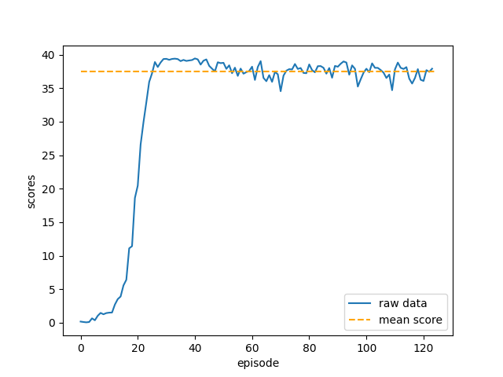

# Udacity-Continuous-Control-Project

### Environment Description

This project uses deep deterministic policy gradient to teach a robotic arm to balance a ball.

In this environment, a double-jointed arm can move to target locations. A reward of +0.1 is provided for each step that the agent's hand is in the goal location. Thus, the goal of your agent is to maintain its position at the target location for as many time steps as possible.

The observation space consists of 33 variables corresponding to position, rotation, velocity, and angular velocities of the arm. Each action is a vector with four numbers, corresponding to torque applicable to two joints. Every entry in the action vector should be a number between -1 and 1.

  

Video of multiple agents in the Unity ML-Agents Reacher Environment.

### Setting up the Repository

##### List of Dependencies

Below is the list of requirements.
<ul>
<li> python==3.6.3 </li>
<li> numpy==1.12.1 </li>
<li> matplotlib==2.1.0 </li>
<li> torch==0.4.0 </li>
<li> unityagents==0.4.0 </li>
</ul>

unityagents has been replaced by ml-agents

Can be installed with:
python -m pip install mlagents==0.30.0

##### Installation Procedure
Download the environment from one of the links below. You need only select the environment that matches your operating system:

- Linux: **[click here](https://s3-us-west-1.amazonaws.com/udacity-drlnd/P1/Banana/Banana_Linux.zip)**
- Mac OSX: **[click here](https://s3-us-west-1.amazonaws.com/udacity-drlnd/P1/Banana/Banana.app.zip)**
- Windows (32-bit): **[click here](https://s3-us-west-1.amazonaws.com/udacity-drlnd/P1/Banana/Banana_Windows_x86.zip)**
- Windows (64-bit): **[click here](https://s3-us-west-1.amazonaws.com/udacity-drlnd/P1/Banana/Banana_Windows_x86_64.zip)**

Clone this repository using: git clone https://github.com/tauon1777/Udacity-Navigation-Project.git

Place the zip file in the GitHub repository and unzip (or decompress) the file.

The agent should be ready to train.

If needed, additional instructions are located at:

[Udacity Project 1: Navigation](https://github.com/udacity/deep-reinforcement-learning/tree/master/p1_navigation).

[Udacity Deep Reinforcement Learning Repository](https://github.com/udacity/deep-reinforcement-learning#dependencies).

### Training an Agent

The main function is located in the Navigation.ipynb file. Running the cells in this file will train an agent from scratch. It might be necessary to correct the path to the Banana Collector environment executable.

The agent trains for 2000 episodes by default, using the same hyperparameters outlined in the report. The performance of the agent should be comparable to the results below.

  

